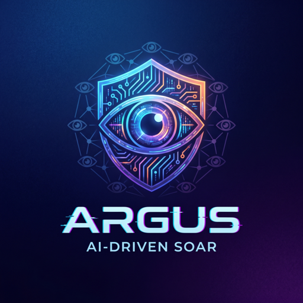
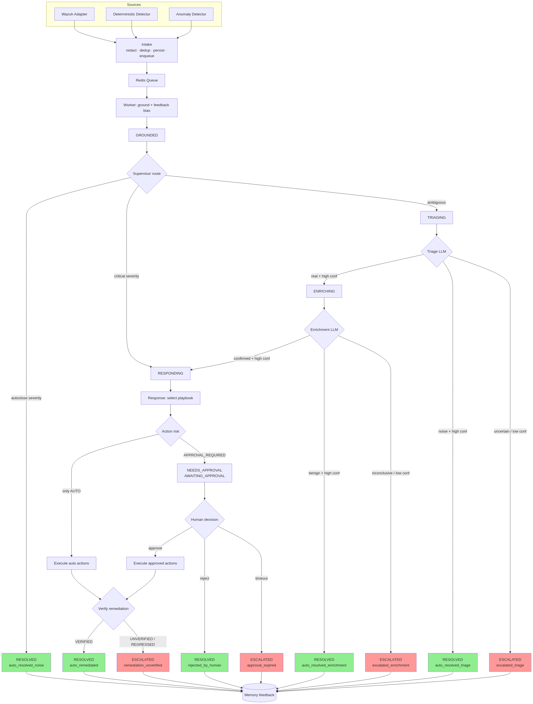
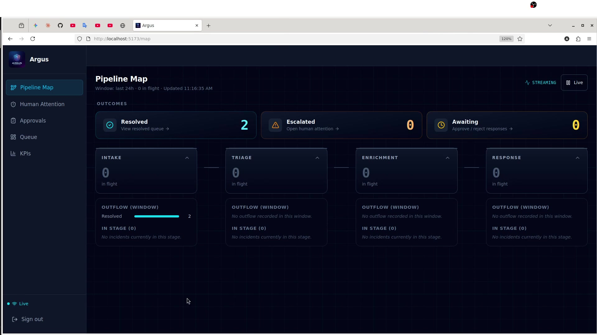
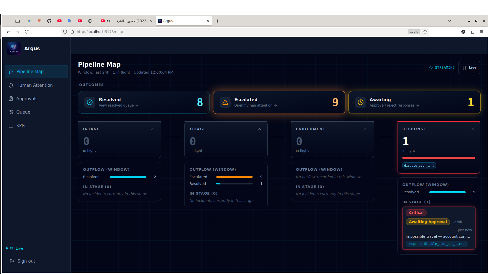
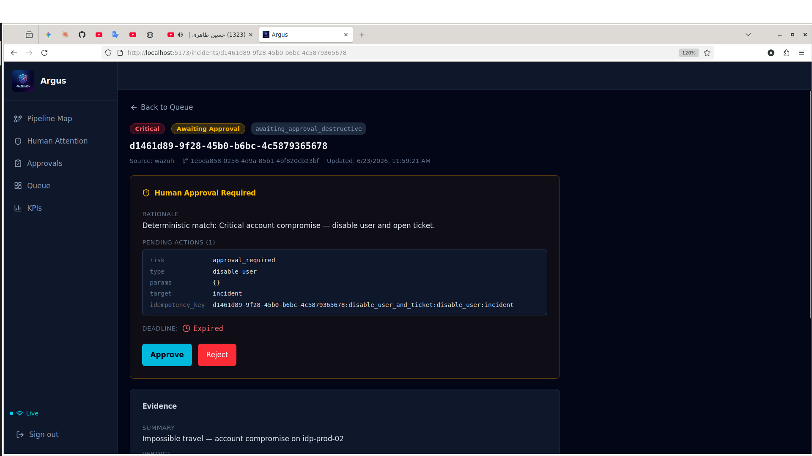
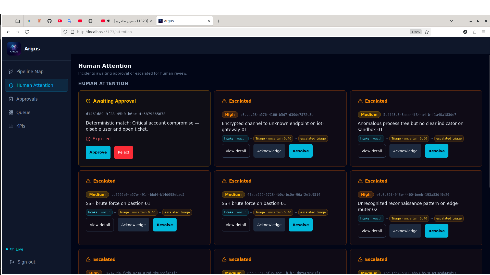

<div align="center">



# Argus — AI-driven SOAR Platform

**Autonomous SOC analyst: every SIEM alert triaged, enriched, remediated, verified, and remembered.**


</div>

---

## What is Argus?

Argus is an end-to-end **SOAR** (Security Orchestration, Automation & Response) platform that takes a
raw SIEM alert and drives it — autonomously — through a deterministic incident pipeline: **triage →
enrichment → response (with human-in-the-loop approval) → remediation verification → memory feedback**.

It is built on a strict principle: **LLMs reason, code decides.** A plain async **state-machine
supervisor** is the single writer of incident status; the LLM stages only produce evidence the
supervisor routes on. The acting stage is default-deny — anything destructive parks for human
approval. Every terminal outcome is written back to a temporal memory graph so the *next* incident on
the same entity is biased by what happened last time. That loop — detection → response → verify →
memory → next detection — is what makes Argus close the analyst's feedback circle instead of just
firing alerts.

Two **complementary, decoupled detectors** feed the same ingestion contract as a live Wazuh webhook:
a deterministic **rule/threshold detector** and a UEBA-style **ML anomaly detector** (Isolation
Forest). Signature and anomaly cover each other's blind spots.

---

## The pipeline



### Three detection sources → one ingestion contract

| Source | Entry point | Mechanism |
|---|---|---|
| **Live Wazuh** | `POST /ingest/wazuh` | Real webhook alert (`source="wazuh"`) |
| **Rule detector** (#14) | `python -m backend.detector` | Deterministic `match` + `threshold` rules over replayed events (`source="detector"`) |
| **ML anomaly detector** (#17) | `python -m backend.anomaly_detector` | Isolation Forest scores per-entity time windows for behavioral deviation (`source="anomaly-detector"`) |

All three call the **same** `services.intake.accept(...)` seam: redact (fail-closed) → dedup
fingerprint (Redis `SET NX EX`) → persist `Incident(RECEIVED)` → enqueue → `202`. The detectors needed
**zero downstream change** — `source` was the only new parameter.

### Supervisor stages

1. **Grounding** (worker, deterministic) — `NormalizedEvent → Evidence`; applies the read-side of the
   feedback loop (severity bias + `prior_failure` flag from prior outcomes on the same entity).
2. **Triage** — one structured LLM call → `real / noise / uncertain`; fail-closed (bad output →
   escalate).
3. **Enrichment** — bounded retrieval fan-out (knowledge corpus + temporal memory + threat intel) +
   one LLM call; read-only, no write authority.
4. **Response** — deterministic playbook selection; default-deny policy auto-executes allowlisted
   actions, parks destructive ones at `AWAITING_APPROVAL` for human decision (`GET /approvals`,
   `POST /approvals/{id}/decision`).
5. **Verification** — re-checks indicators + probes executor post-state, worst-case aggregated;
   `unverified`/`regressed` re-escalates instead of falsely closing.
6. **Feedback write-back** — off-path, post-terminal: one redacted episode + outcome facts written to
   temporal memory, keyed so a future incident's grounding read hits.

A full, code-grounded walkthrough lives in **[docs/pipeline-end-to-end.md](docs/pipeline-end-to-end.md)**.

---

## Quick start (fresh clone)

```bash
git clone https://github.com/alimsaleh1212-create/Argus.git && cd Argus
cp .env.example .env            # defaults work for local dev
docker compose up -d --wait     # brings up the full stack + runs migrate/seed one-shots
```

Once healthy (usually < 1 min):

```bash
curl http://localhost:8000/health   # → {"status":"ok"}
curl http://localhost:8000/ready    # → 200, all deps healthy
```

| Surface | URL |
|---|---|
| API (FastAPI) | http://localhost:8000 |
| Operations dashboard (React) | http://localhost:5173 |
| pgAdmin | http://localhost:5050 |
| MinIO console | http://localhost:9001 |
| Neo4j browser | http://localhost:7474 |

On `docker compose up`, one-shot `migrate` and `vault-seed` services run *before* the API — no manual
migration or secret step. A `seed-corpus` one-shot loads the reference knowledge corpus.

### Prerequisites

- Docker Engine + Docker Compose v2
- [`uv`](https://docs.astral.sh/uv/) — `curl -LsSf https://astral.sh/uv/install.sh | sh`
- `git`

---

## 🎬 Demo

[](docs/assets/demo/argus-demo.mp4)

*▶ Click the image above to play the full walkthrough (~1.5 min).*

### Highlights

| SOC pipeline map | Human-in-the-loop approvals | Attention lane |
|---|---|---|
|  |  |  |

---

## Operations dashboard

A separate React SPA (`frontend/`) over read-side endpoints — incident queue, detail, audit trail,
trace view, KPIs, and a live SSE stream. It is **read-only except approve/reject**, which reuses the
same approval endpoint as the API; the supervisor remains the single writer of state. Admin auth is
username + password (Vault) → HS256 JWT.

---

## Development

```bash
make install            # uv sync (pinned deps)
make up / make down     # docker compose up -d --wait / down -v
make migrate            # alembic upgrade head
make lint / make fmt    # ruff + import-linter
```

### Tests (memory-safe, batched)

Heavy imports (spaCy/Presidio, Graphiti) make a single monolithic `pytest` run OOM, so tests run
batched — each file in its own subprocess.

```bash
make test               # unit tier (fast, no Docker)
make test-integration   # testcontainers tier (Docker)
make test-e2e           # in-process e2e tier
make test-smoke         # true e2e against a running compose stack
make cov                # combined coverage gate, fail < 80%
```

### Evaluation gates

Twelve deterministic, provider-aware eval suites are declared in `config/eval_thresholds.yaml` and run
through a registry (declared⇔registered mismatch is a hard error):

`smoke · redaction · supervisor_routing · llm_provider · triage · retrieval · temporal_memory ·
rationale · verification · feedback · detection · anomaly_detection`

```bash
make eval               # per-PR run (Ollama only, deterministic gates)
make eval-freeze        # full freeze: both providers + MinIO upload
```

---

## Architecture

```
argus/
├── backend/                 # one Python image; runs as api / worker / migrate / one-shots
│   ├── main.py              # app factory          worker.py        # queue consumer
│   ├── routers/             # thin HTTP layer (ingest, incidents, approvals, health)
│   ├── services/            # use-case orchestration (intake, supervisor, detector, anomaly, ...)
│   ├── agents/              # LLM stages: triage / enrichment / response
│   ├── repositories/        # data access
│   ├── domain/              # pure types/enums (no outward deps)
│   ├── infra/               # config, container, lifespan, vault, db, llm, memory, executors, ...
│   ├── eval/                # consolidated evaluation harness (python -m backend.eval)
│   └── db/migrations/       # Alembic (async)
├── frontend/                # React operations dashboard (Node 20)
├── config/                  # alembic.ini, eval_thresholds.yaml, detector/anomaly configs
├── deploy/<svc>/Dockerfile  # one Dockerfile per built image
└── compose.yaml  pyproject.toml  uv.lock  Makefile
```

Import direction is **inward-only** (`routers → services → agents → repositories → infra`; `domain`
isolated), enforced in CI by `import-linter`. One backend image runs as several containers (api /
worker / migrate / detectors) — different commands, same venv.

---

## Documentation

See **[docs/](docs/README.md)** for the full index. Highlights:

- [Pipeline, end to end](docs/pipeline-end-to-end.md) — code-grounded walkthrough
- [Demo playbook](docs/demo-playbook.md) — guided scenarios
- [Anomaly detector mechanism](docs/anomal-detector-mechanism.md) · [SIEM ML detector](docs/siem-ml-detector.md)
- [Seeding architecture](docs/seeding-architecture.md)
- [DECISIONS.md](DECISIONS.md) — the full decision log
- `specs/` — per-component specifications, plans, and design artifacts

---

_v1.0.0 — built across 17 components (platform → observability → LLM provider → ingestion → state
machine → triage → memory → corpus → enrichment → response → dashboard → eval harness → verification →
feedback loop → rule detector → ML anomaly detector)._
